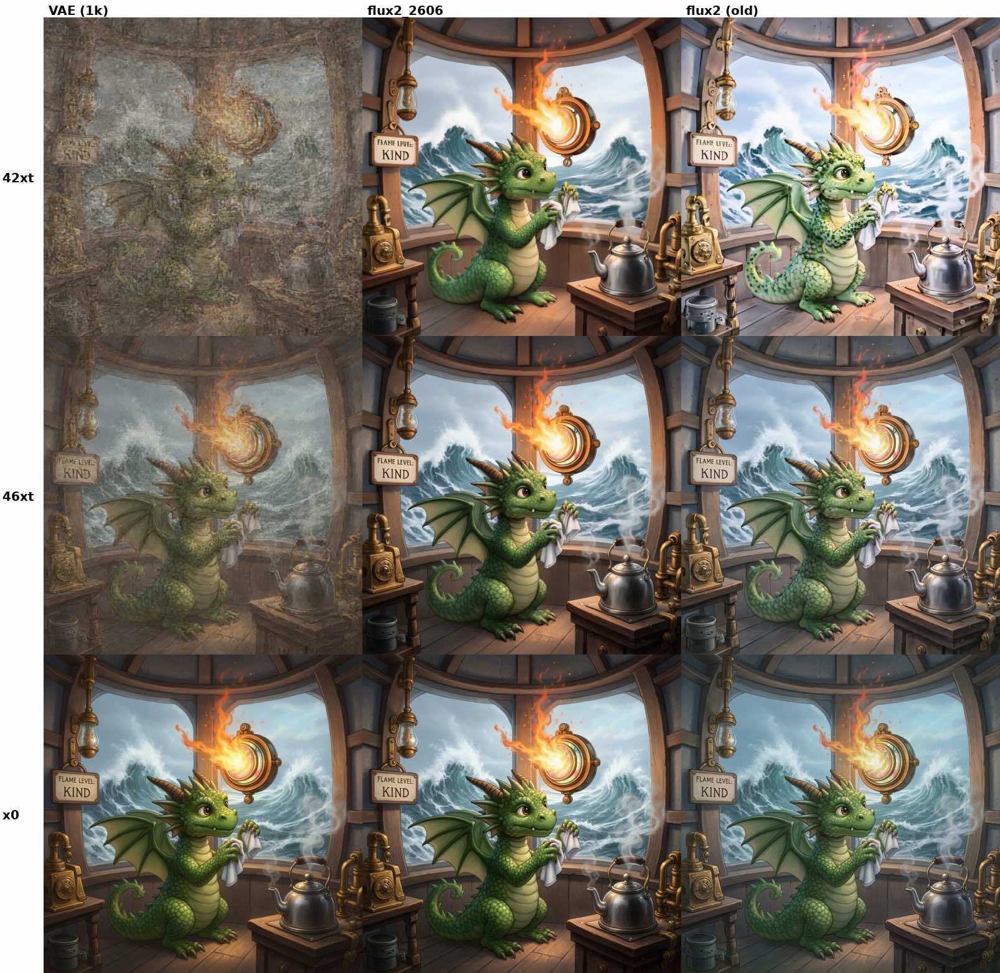
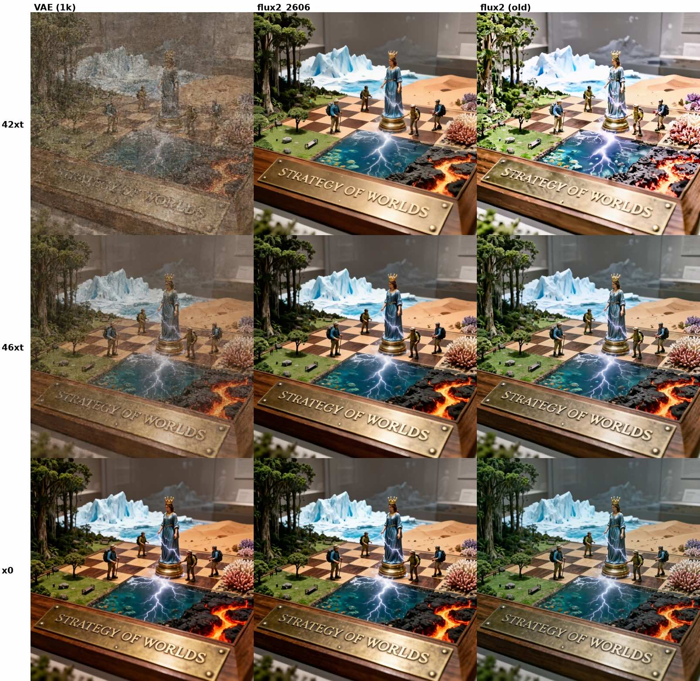
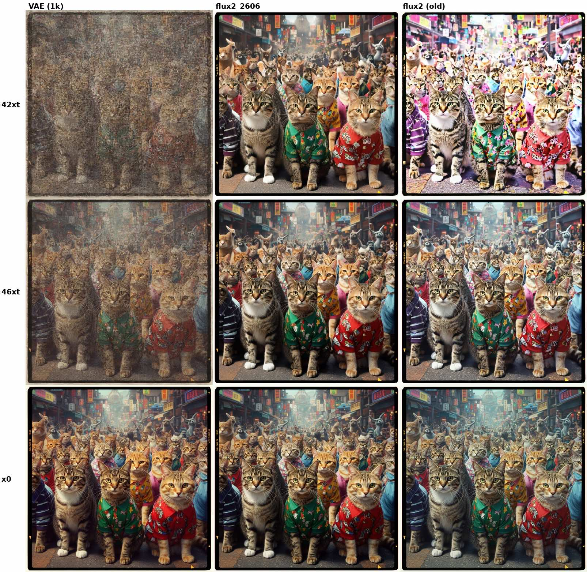

# FLUX.2 (2kto4k) — `_2606` checkpoint vs. the old one

The refreshed **FLUX.2 (2kto4k)** decoder (weights under
`checkpoints/PiD_res2kto4k_sr4x_official_flux2_distill_4step_2606/`) fixes two color issues:

1. **`x0` color drift** — the old decoder's final-latent output drifted in color vs. the native VAE; `_2606` matches it.
2. **Early-termination whitening** — with `--save_xt_steps`, the old decoder washed images out (earlier timestep → whiter); `_2606` stays consistent across timesteps.

Each figure is a 3 × 3 grid. Columns: `VAE (1k)` (reference), `flux2_2606` (new), `flux2 (old)`. Rows top→bottom: `42xt` → `46xt` → `x0` (earliest termination on top).

  
  
  

`_2606` is the default for `flux2 --pid_ckpt_type 2kto4k`, so no extra flags are needed.
